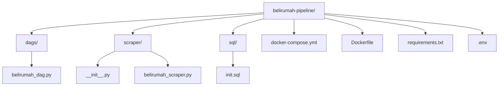

# Pipeline Diagram



## Project structure

- `dags/`
  - `belirumah_dag.py`
- `scraper/`
  - `__init__.py`
  - `belirumah_scraper.py` — your existing scraper refactored into functions
- `sql/`
  - `init.sql`
- `docker-compose.yml`
- `Dockerfile`
- `requirements.txt`
- `.env`

## Start & stop

```bash
docker compose up --build
docker compose down
```